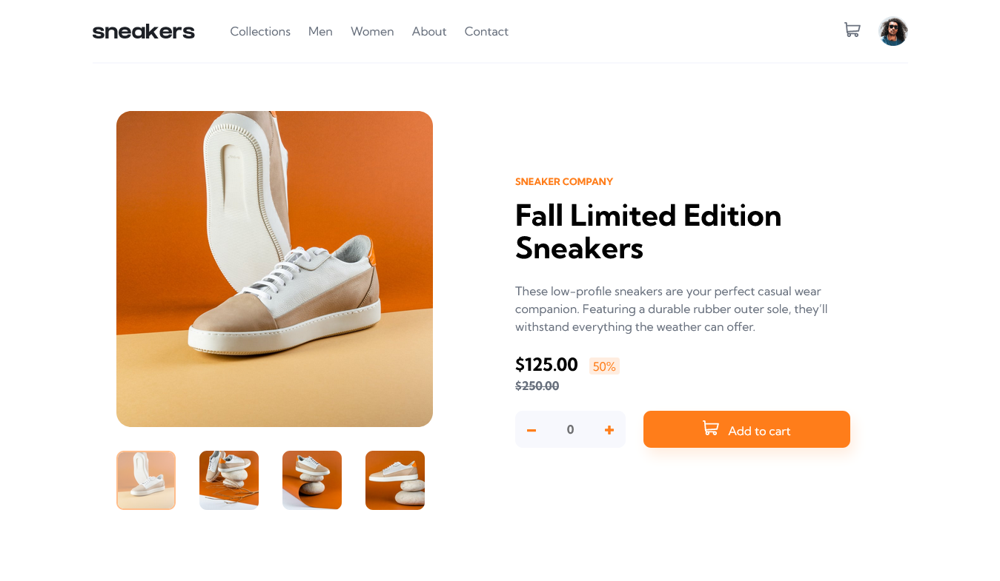

# Frontend Mentor - E-commerce product page solution

This is a solution to the [E-commerce product page challenge on Frontend Mentor](https://www.frontendmentor.io/challenges/ecommerce-product-page-UPsZ9MJp6).

## Table of contents

- [The challenge](#the-challenge)
- [Screenshot](#screenshot)
- [Links](#links)
- [Built with](#built-with)
- [Author](#author)

### The challenge

Users should be able to:

- View the optimal layout for the site depending on their device's screen size
- See hover states for all interactive elements on the page
- Open a lightbox gallery by clicking on the large product image
- Switch the large product image by clicking on the small thumbnail images
- Add items to the cart
- View the cart and remove items from it

### Screenshot

### Links

- Solution URL: [Github](https://github.com/sangodare/ecommerce-product-page.git)
- Live Site URL: [Netlify](https://ecommerceprdpagebytoyeeb.netlify.app/)

### Built with HTML, CSS and JavaScript

The solution to the challenge was built with HTML, CSS and JavaScript. I made use of semantic HTML5 markup, CSS custom properties, flexbox and so on in bringing the design to life.

## Author

- Frontend Mentor - [@sangodare](https://www.frontendmentor.io/profile/sangodare)
